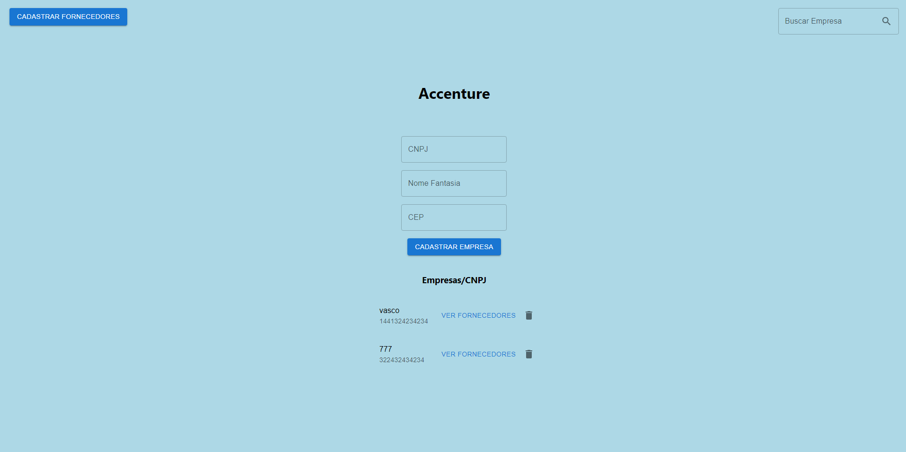

# Accenture Full-Stack Challenge

Este documento fornece instruções sobre como rodar o projeto e lista as tecnologias utilizadas. Primeiramente, começarei falando sobre as tecnologias utilizadas (C# e JavaScript), depois os pré-requisitos, como rodar o projeto na sua máquina e também pelo Docker. E enfim, mas não menos importante, minhas conclusões sobre esse desafio. 

## Tecnologias Utilizadas

O projeto utiliza as seguintes tecnologias:

- ASP.NET: Framework de desenvolvimento web para a criação da API.
- .NET 6: Versão do framework .NET utilizada no projeto.
- SQL Server: Banco de dados utilizado para armazenar os dados.
- React: Biblioteca JavaScript utilizada para criar a interface do usuário.

## Pré-requisitos

Antes de rodar o projeto, certifique-se de ter os seguintes requisitos instalados em seu ambiente de desenvolvimento:

- .NET 6 SDK
- Node.js
- Docker (opcional, apenas se desejar rodar o projeto com Docker)

## Rodando o Projeto

Siga as instruções abaixo para rodar o projeto em seu ambiente de desenvolvimento:

1. Clone o repositório para sua máquina local:

2. API (ASP.NET):

- Abra o projeto da API em sua IDE preferida (Visual Studio, Visual Studio Code, etc.).
- Certifique-se de que o banco de dados SQL Server esteja configurado corretamente. Caso contrário, atualize a string de conexão no arquivo `appsettings.json` para apontar para seu banco de dados.
- Restaure as dependências do projeto e rode a API.

3. Front-end (React):

- Abra o terminal e navegue até a pasta do projeto front-end.
- Execute o seguinte comando para instalar as dependências:

  ```
  npm install
  ```

  or, please

  ```
  npm install --force
  ```


- Após a instalação, execute o seguinte comando para iniciar o servidor de desenvolvimento:

  ```
  npm start
  ```

4. Acesse a aplicação:

- Abra um navegador e acesse `http://localhost:3000` para visualizar a aplicação front-end.

## Rodando o Projeto com Docker

Se desejar rodar o projeto utilizando Docker, siga as etapas abaixo:

1. Certifique-se de que o Docker esteja instalado e em execução em seu ambiente de desenvolvimento.

2. Abra o terminal e navegue até a pasta raiz do projeto.

3. Execute o seguinte comando para construir as imagens e criar os containers:

4. Aguarde até que o processo de construção seja concluído e os containers estejam em execução.

5. Acesse a aplicação:

- Abra um navegador e acesse `http://localhost:3000` para visualizar a aplicação front-end.

## Conclusão

Com as instruções acima, você será capaz de rodar o projeto em seu ambiente de desenvolvimento. Certifique-se de ter os pré-requisitos instalados corretamente e siga as etapas conforme mencionado. Em caso de dúvidas ou problemas, consulte a documentação adicional ou entre em contato comigo (vitorxaveiro@gmail.com). Por fim, foi um projeto bem desafiador onde aprendi coisas novas e adaptei o que já conhecia, escolhi as linguagens mencionadas acima, pois foi o que estava usando na minha mais recente experiência profissional e assim poderia agilizar a conclusão do desafio. 

## Imagens do sistema



### fornecedores da empresa vasco


